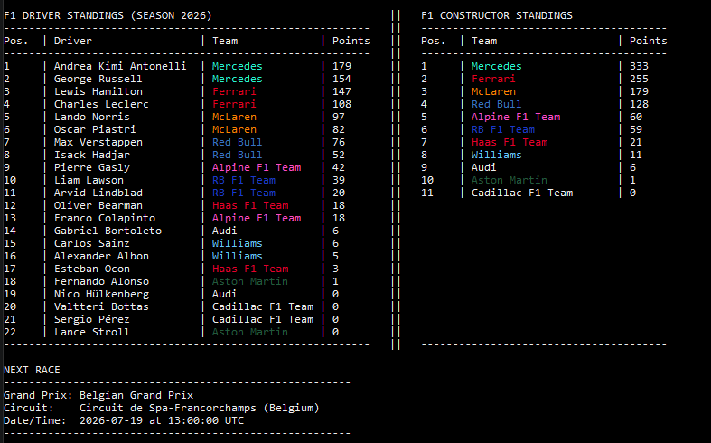

# F1 Status CLI 

A simple, colorful Command Line Interface (CLI) tool written in Python that fetches the current Formula 1 standings and upcoming race information directly in your terminal.

## Features
* **Driver Standings:** Displays the current season's driver championship points and positions.
* **Constructor Standings:** Shows the current team rankings.
* **Next Race Info:** Provides the grand prix name, circuit location, date, and time.
* **Team Colors:** Automatically colors F1 team names in the terminal with their official branding colors.

## Prerequisites
* Python 3.x
* `requests` library

## Installation

1. Clone or download this repository to your local machine.
2. Install the required Python package by running:
   ```bash
   pip install requests
   ```

## Global Command Setup (Windows)
To run the program from anywhere in your terminal just by typing f1status, follow these steps:

1. Create a file named f1status.bat in the exact same folder as your Python script.
2. Add the folder containing the .bat file to your Windows Environment Variables:
    - Search for "Environment Variables" in the Windows Start menu.
    - Edit the Path variable under "User variables".
    - Click "New" and paste the path to your folder.
    - Click "OK" on all windows to save.
3. Restart your terminal.

## Usage
Simply open your terminal (e.g., PowerShell) and type:

```Bash
f1status
```


## Data Source
This project uses the Jolpica API, an open-source, up-to-date, drop-in replacement for the deprecated Ergast F1 API.